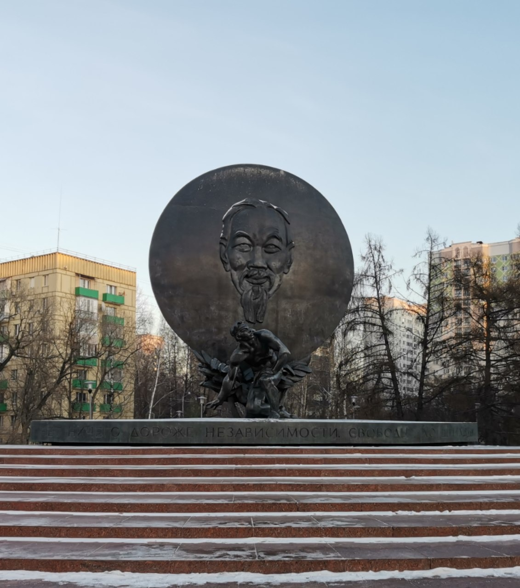

**Оценка:** ★★★★ (4/5)

Почти каждый день прохожу мимо этого памятника, но остановилась около него и прочитала надпись только после прочтения “Сочувствующего”.

Я решила читать в оригинале, что сильно замедлило скорость. И обычно читаю от корки до корки, даже отзывы в начале, но тут их было так много и это было так неинтересно, что я пролистала. Уже перейдя к тексту самого романа, меня удивил главный герой, не очень скромно заявляющий:

> I am simply able to see any issue from both sides

Закатила глаза, подумала про ненадежного рассказчика и не поверила ему. Но в процессе стала больше доверять, хотя оказывается у этой версии исповеди было несколько черновиков: despite my many drafts — чем интересно отличались версии признания друг от друга?

> I cannot help but wonder, writing this confession, whether I own my own representation or where you, my confessor, do

Описание эвакуации из Сайгона мне напомнило то, что я видела по телевизору в 2021 году, когда показывали людей, падающих из самолета, но всеми силами пытавшихся туда влезть, чтобы улететь из Афганистана.

Несмотря на реалистичность в ключевых моментах книги есть что-то мифическое: вернуться на родину через убийство единомышленника, а где-то теряется смысл действий героев, например, поход их отряда в конце, может там и был план у генерала, но есть сомнения.

Много иронии разбавляет жестокость происходящего. Очень было смешно читать таблицу черт героя с двумя колонками: ORIENT и OCCIDENT. В целом отношения с профессором показаны иронично. Эпизод с кальмаром тоже позабавил.

Не поняла, почему всего два призрака виделись главному герою. Шпионка не умерла, но он этого не знал, бездействовал при убийстве двух людей. В этом состояло переобучение? Почувствовать вину за то, что не предотвратил гибель других?

Эпизод с насилием шпионки был забыт после взрыва на съемочной площадке? И почему пытки восстанавливают память?

Интересно было как передадут двойственность фразы NOTHING IS MORE PRECIOUS THAN INDEPENDENCE AND FREEDOM в переводе:

> Нет ничего дороже свободы и независимости, но вместе с тем ничего дороже свободы и независимости

Теперь я и правда не могу нормально воспринимать словосочетание холодная война

> What a joke, given how hot the war has been for us

Возвращаясь к таланту главного героя видеть все с двух сторон: вроде это так и работает, с кем живешь, тому и сочувствуешь, а он и видел жизнь с двух сторон. Ман видел только с одной стороны, но как, кажется, ему хватило и этого.

Мне показалось, что эта книга все же подробнее описывает физиологические детали (сцены с пытками сложно читать) и здесь я сопереживала жертвам насилия больше, чем в “Семи лунах”.

Линия со съемкой фильма очень хорошо показывает как создается то, что потом влияет на наше видение мира, поэтому мне очень нравится, что мы читаем в книжном клубе таких разных авторов. Мне понравилось. Буду ждать сериал и надеюсь на этой неделе начать “Преданного” (”Commited”)

[Ссылка на Telegraph](https://telegra.ph/Sochuvstvuyushchij---Vet-Than-Nguen-01-08)